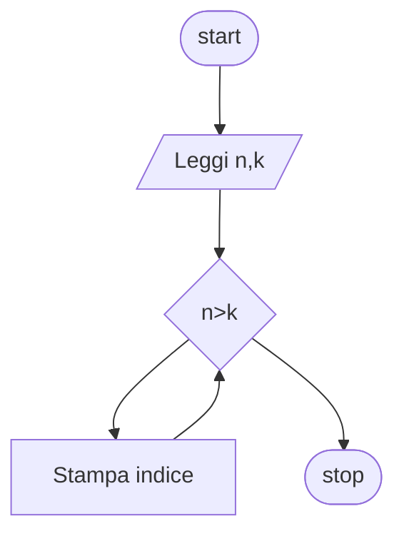

# Cicli 1:

**Quesito:** Presi due numeri stampa i numeri a partire dal numero più piccolo al numero più grande

## Diagramma di flusso



## Pseudo-codifica

```
INIZIO.

Leggi n,k;
i=n
Fintanto che i<=k
    Stampa i;
fine-ciclo

FINE.
```

Usiamo come valori 3 e 7
||Risultato|
|-|-|
|Stampa|`3,4,5,6,7`|
