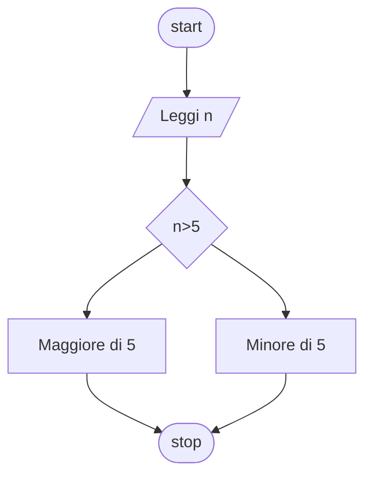

# Condizioni 1:

**Quesito:** Controlla se il numero inserito è maggiore di 5

## Diagramma di flusso



## Pseudo-codifica

```
INIZIO.

Leggi n;
Se n>5
    Stampa Maggiore di 5;
Altrimenti
    Stampa Minore di 5;
fine-se

FINE.
```

Usiamo come valori 10 e 4
||Risultato|
|-|-|
|10|`Maggiore`|
|5|`Minore`|
