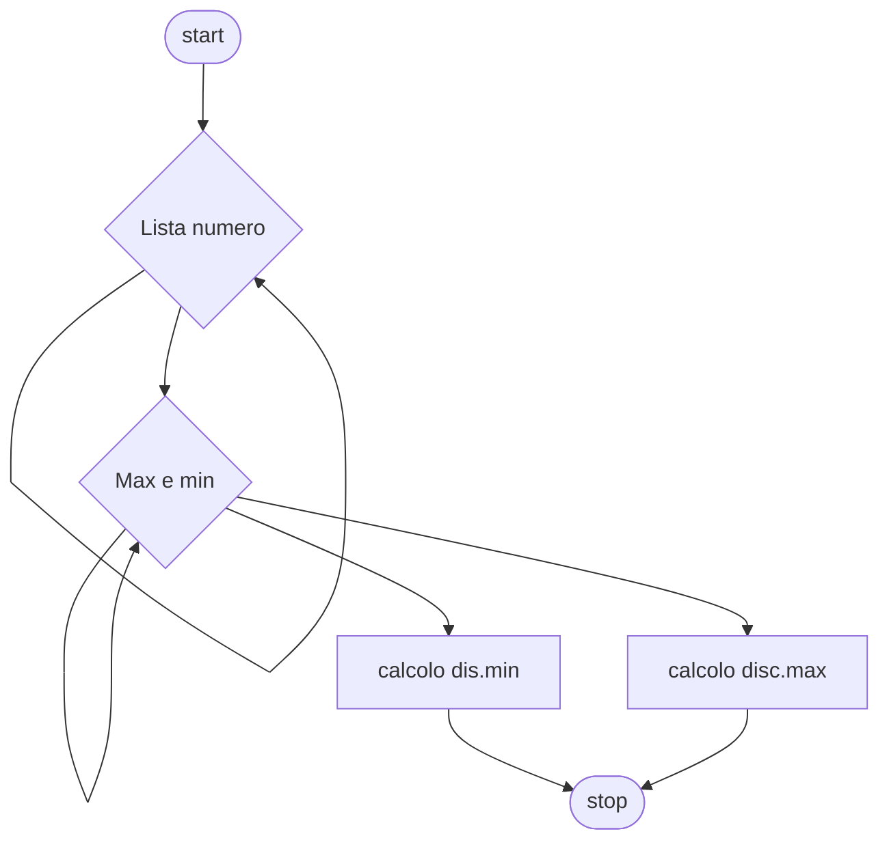

# Livello avanzato 1:

**Quesito:** Presa una lista di numeri trova il numero più grande ed il più piccolo, calcola la media della lista e calcola il discostamento dei due valori dalla media.

## Diagramma di flusso


## Pseudo-codifica

```
INIZIO.

indice=1;
somma=0
Fintanto che indice<6
  Leggi numero_lista;
fine-ciclo
Fintanto che indice<6
  somma = somma + nulero_lista[indice];
  Se min>numero_lista[indice]
    min=numero_lista[indice];
  fine-se
  Se max<numero_lista[indice]
    max=numero_lista[indice];
  fine-se
fine-ciclo
disc.min=media-min;
disc.max=max-media;
Stampa disc.min, disc.max;

FINE.
```

Usiamo come valori 1,3,5,7,9

||Risultato|
|-|-|
|Media|`5`|
|Discostamento minimo|`4`|
|Discostamento massimo|`4`|