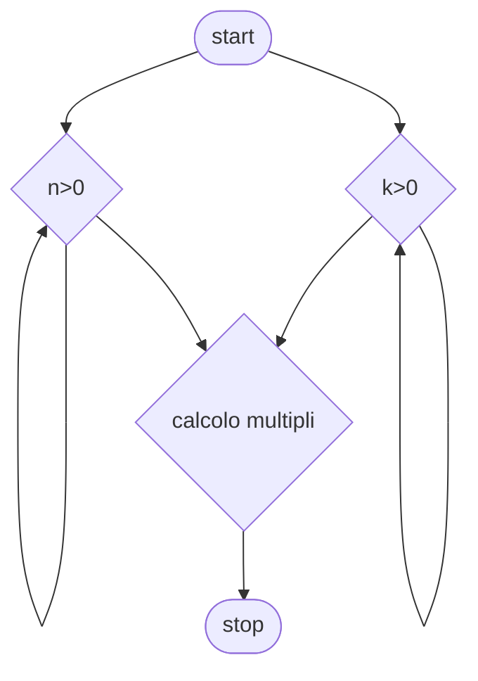

# Livello avanzato 2:

**Quesito:** Presi due numeri interi (n,k) controlla che siano maggiori di zero e trova i primi n multipli di k.

## Diagramma di flusso


## Pseudo-codifica

```
INIZIO.

Leggi n,k;
i=1;
lista_numeri=[];
Fintanto che i<=n
    lista_numeri[i]=k*i;
    i++;
Fine-ciclo
Stampa lista_numeri
FINE.
```

Usiamo come valori 4,5

||Risultato|
|-|-|
|Multipli|`5, 10, 15, 20`|