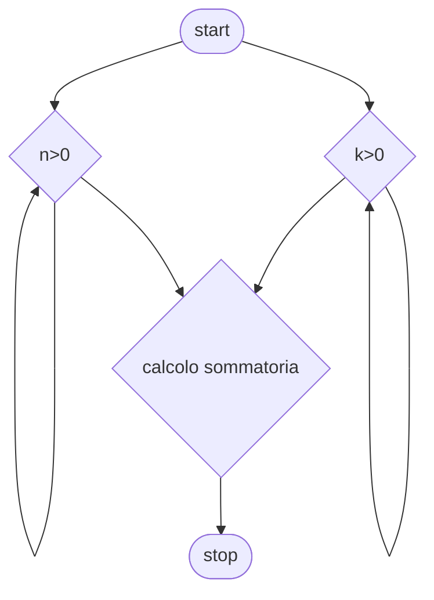

# Livello avanzato 3:

**Quesito:** Presi due numeri interi (n,k) controlla che siano maggiori di zero e trova i primi n multipli di k.

## Diagramma di flusso


## Pseudo-codifica

```
INIZIO.

Leggi n,k;
i=1;
somma=0;
Fintanto che i<=n
    somma=somma+(p*i);
    i++;
Fine-ciclo
Stampa somma
FINE.
```

Usiamo come valori 4,5

||Risultato|
|-|-|
|Somma|`50`|