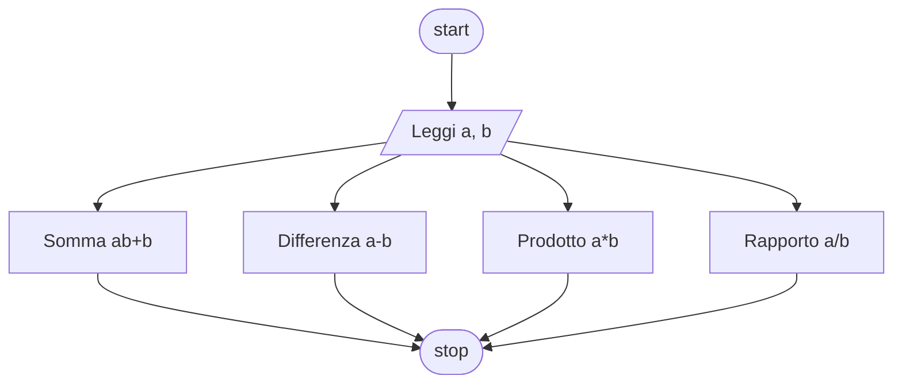

# Livello base 1:

**Quesito:** Presi due numeri esegui una somma, una differenza, una moltiplicazione ed una divisione.

## Diagramma di flusso



## Pseudo-codifica
#### Example 1.1

```
INIZIO.

Leggi numero_uno;
Leggi numero_due;
somma = numero_uno + numero_2;
differenza = numero_uno - numero_2;
prodotto = numero_uno * numero_2;
rapporto = numero_uno / numero_2;
Stampa somma, differenza, prodotto, rapporto;

FINE.
```

Usiamo come valori 10 e 5
||Risultato|
|-|-|
|Somma|`15`|
|Differenza|`5`|
|Prodotto|`50`|
|Rapporto|`2`|

<details>
  <summary><strong>Possibili errori</strong></summary>

  > In alcuni linguaggi di programmazione si unisce due stringe usando il +, quindi ricorriamo ad una doppia negazione per creare una somma. Se i due numeri vengono salvati come numeri e non come stringhe questo problema non si pone.

</details>