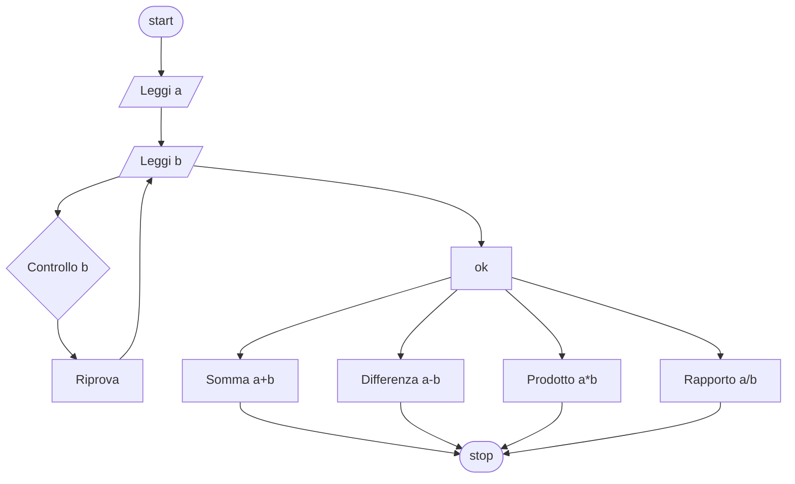

# Livello base 1:

**Quesito:** Presi due numeri controlla che il secondo sia minore del primo e che sia diverso da zero. Esegui una somma, una differenza, una moltiplicazione ed una divisione.

## Diagramma di flusso



## Pseudo-codifica
#### Example 1.1

```
INIZIO.

Leggi numero_uno;
Fintanto che numero_uno>numero_2 && numero_due!=0
  Leggi numero_due;
fine-ciclo
somma = numero_uno + numero_2;
differenza = numero_uno - numero_2;
prodotto = numero_uno * numero_2;
rapporto = numero_uno / numero_2;
Stampa somma, differenza, prodotto, rapporto;

FINE.
```

Usiamo come valori 10, 11, 0 e 5. Il programma dovrebbe continuare a chiederti il secondo valore poichè sia 11 che lo 0 non soddisfano le condizioni.

||Risultato|
|-|-|
|Somma|`15`|
|Differenza|`5`|
|Prodotto|`50`|
|Rapporto|`2`|

<details>
  <summary><strong>Perchè un do-while e non un if?</strong></summary>

  > Il do-while permette di richiedere all'utente il numero corretto all'infinito, mentre un if funzionerebbe solo al primo tentativo.

</details>