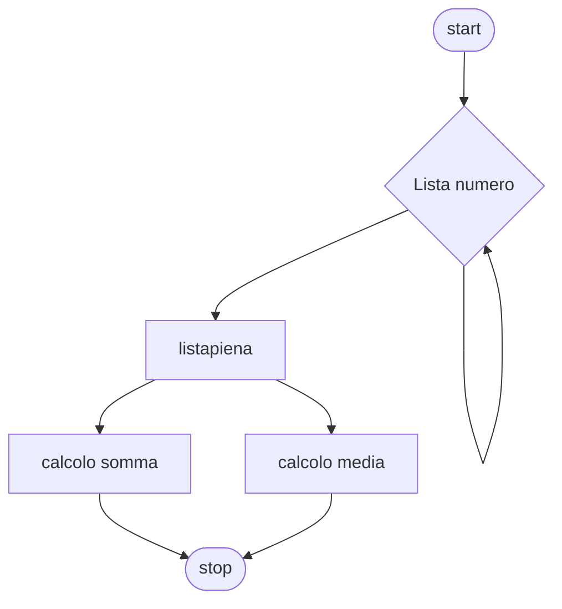

# Livello base 1:

**Quesito:** Presa una lista di cinque numeri esegui una somma ed una media.


## Diagramma di flusso


## Pseudo-codifica

```
INIZIO.

indice=1;
somma=0;
Fintanto che indice<6
  Leggi numero_lista;
fine-ciclo
Fintanto che indice<6
  somma = somma + numero_lista;
fine-ciclo
media = somma/(numero_lista.lenght-1);
Stampa somma, media;

FINE.
```

Usiamo come valori 1,2,3,4,5

||Risultato|
|-|-|
|Somma|`15`|
|Media|`3`|