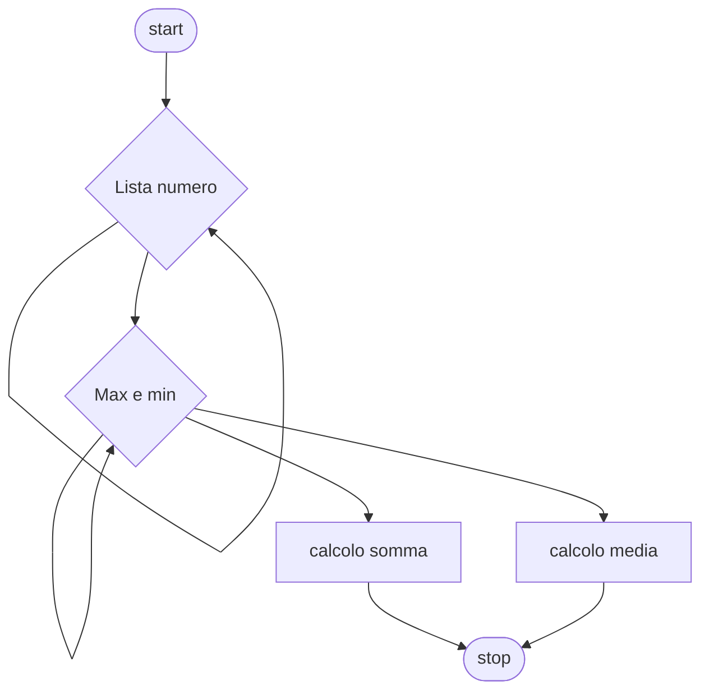

# Livello intermedio 1:

**Quesito:** Presa una lista di cinque numeri trova il numero più grande ed il più piccolo, esegui una somma ed una differenza dei due valori.


## Diagramma di flusso


## Pseudo-codifica

```
INIZIO.

indice=1;
Fintanto che indice<6
  Leggi numero_lista;
fine-ciclo
Fintanto che indice<6
  Se min>numero_lista[indice]
    min=numero_lista[indice];
  fine-se
  Se max<numero_lista[indice]
    max=numero_lista[indice];
  fine-se
fine-ciclo
somma=max+min
differenza=max-min
Stampa somma, differenza;

FINE.
```

Usiamo come valori 12,2,4,-1,4

||Risultato|
|-|-|
|Somma|`11`|
|Differenza|`13`|