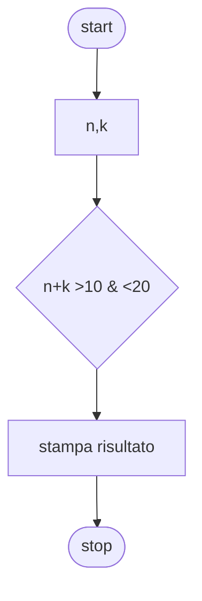

# Livello intermedio 2:

**Quesito:** Presi due numeri se la loro somma è maggiore di dieci e minore di venti stampa la media


## Diagramma di flusso


## Pseudo-codifica

```
INIZIO.

Leggi n,k;
somma = n+k;
Se somma>10
    Se somma<20
        Stampa "somma maggiore di 10 e minore di 20";
        Stampa somma/2;
    Altrimenti
        Stampa "somma maggiore di 10 e maggiore di 20";
    fine-se
Altrimenti
    Stampa "somma minore di 10";
fine-se
fine-ciclo

FINE.
```

Usiamo come valori 12,6

||Risultato|
|-|-|
|Media|`9`|
|Somma|`18`|